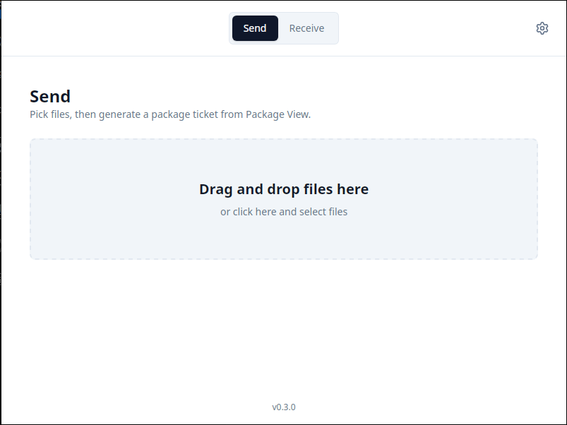
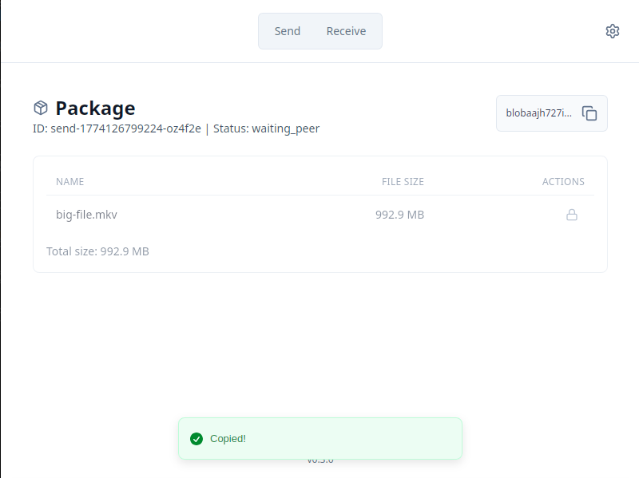
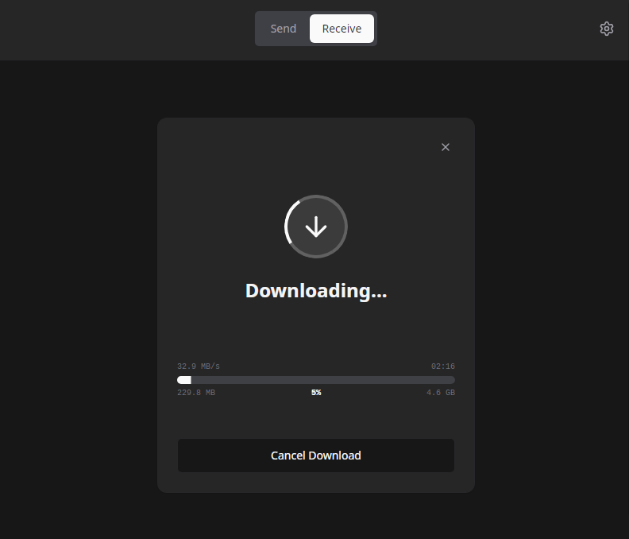
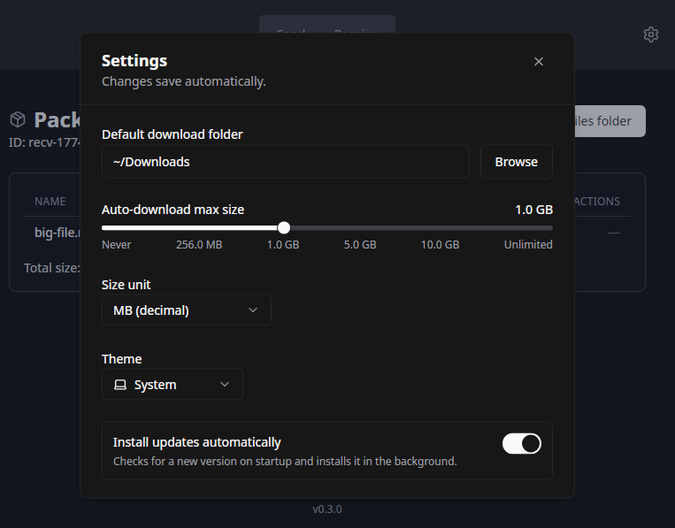

# QuickSendg
QuickSend lets you send files directly from one device to another (Peer to Peer connection).

No account, no cloud upload, no login, no max file size.

Powerd by [iroh](https://github.com/n0-computer/iroh), [Tauri](https://tauri.app/)

## 🔄 Basic Flow

1. On the sender device, open **Send** and select files.
1. Click **Get Package Address**.
1. Copy the generated ticket (it should auto-copy for you).
1. Send the ticket to the other device via any communication channel
1. On the receiver device, open **Receive**.
1. Paste the ticket and click **Preview Package**.
1. Click **Download Package**.

When download finishes, use **Open files folder**.

## 🔒 Privacy

QuickSend is peer-to-peer: files are sent directly between devices during transfer.

## 📜 Unlicense
Read more at [Unlicense](https://unlicense.org/)
